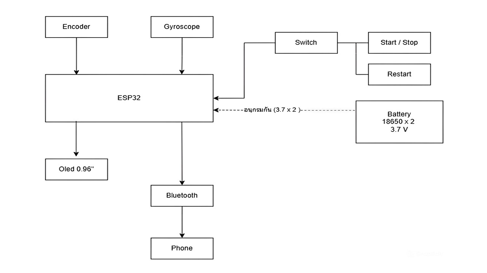
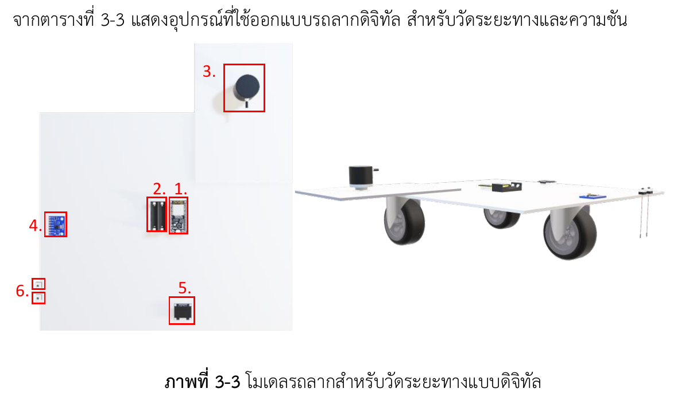

# Hand-Pulled Road Slope and Distance Measuring Device

This project is a **hand-pulled device** to measure road slope and distance.  
It uses the following components:

- **ESP32**: Main microcontroller for data processing.  
- **LED Display**: Shows real-time measurements of distance and slope.  
- **Gyroscope / Accelerometer (Gyro)**: Measures the slope/angle of the road.  
- **Encoder**: Tracks wheel rotations to calculate distance traveled.

